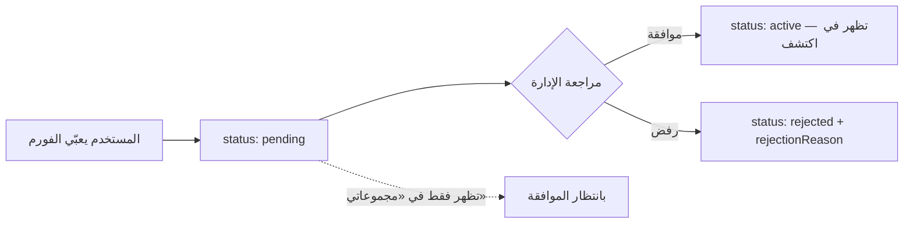

# Groups — Feature Reference & Backend Plan

Everything the groups feature does today, and exactly what the backend has to
provide to replace the mock.

> **Status: fully mocked.** There is no groups API. Every screen reads through
> `src/features/groups/queries.ts`, which calls an in-memory store instead of
> `apiClient`. The store is the *only* file that knows the data is fake — when
> the endpoints land, `queries.ts` gets a real API module and no screen changes.

---

## 1. Screens & routes

| Route | Screen component | What it is |
|---|---|---|
| `/(tabs)/groups` | `GroupsScreen` | Groups tab — three lists: **لك** (suggested), **مجموعاتي** (mine), **اكتشف** (discover) |
| `/groups/create` | `CreateGroupScreen` | Create-group **request** form |
| `/groups/[id]` | `GroupProfileScreen` | Group profile — the main addition |

Routes are registered in [`app/_layout.tsx`](../app/_layout.tsx).

---

## 2. What a user can do

### 2.1 Browse and join

Every group card in all three tabs is now **pressable** and opens that group's
profile. The join / leave control lives on the card *and* on the profile and
behaves identically in both, because both render the same `GroupJoinButton`.

Joining always goes through `GroupJoinDialog` first: the group's rules are
listed and the user must tick **«أوافق على قوانين المجموعة»** before the
confirm button does anything. Leaving is immediate — no dialog. A private group
shows **«طلب انضمام»** instead of **«انضمام»**, and the success toast says the
request is pending moderator approval.

### 2.2 Create a group

The form collects: picture, name, description, category, city, visibility,
rules (one per line), a reviewer-only justification, and optional proposed
admins picked from account search (`AdminsPickerModal`).

Creating does **not** publish a group. It creates a *request*:



A pending group appears only under **مجموعاتي** with a «بانتظار الموافقة» chip,
never in discovery, and its profile shows a review banner instead of a join
button. The creator is always `owner`; proposed admins only get their role after
approval.

**Group picture** (`GroupImagePicker`): square 1:1 crop, optional. Without one,
the group falls back to a tinted tile with the first letter of its name
(`GroupAvatar`) — same fallback everywhere the group appears.

### 2.3 The group profile

Header: cover strip, group picture, name + verification badge, «دورك: …» chip
when the viewer is a member, meta chips (category · city · public/private ·
creation date), three counters (members / posts / posts this week), a stacked
row of member avatars, and the join-leave button.

Three tabs:

| Tab | Content |
|---|---|
| **المنشورات** | The group's own feed — author with role badge, body, likes and comments counters |
| **نبذة** | Description, numbered rules, and the management team (owner + admins + moderators) |
| **مقترح لك** | Content recommended *because of this group* — see §3 |

Pull-to-refresh, loading skeletons, and a "group not found" state are all wired.

### 2.4 Visibility rules

| Group | Viewer | نبذة (rules) | المنشورات | مقترح لك |
|---|---|---|---|---|
| Public | anyone | ✅ | ✅ | ✅ |
| Private | member | ✅ | ✅ | ✅ |
| Private | non-member | ✅ | 🔒 locked notice | 🔒 locked notice |
| Pending | owner | ✅ | ✅ | ✅ (with review banner in the header) |

Rules stay readable to everyone on purpose — a user has to acknowledge them
before joining, so hiding them behind membership would be circular.

### 2.5 Comments

Tapping **التعليقات** on any group post opens `GroupCommentsSheet`, a bottom
sheet (82% height, keyboard-aware) where the user can:

- **read** threads — root comments each with their replies indented beneath,
  role badges on staff comments, relative timestamps;
- **react** — heart toggle per comment with a live counter;
- **reply** — the «رد» button pins a «ترد على فلان ✕» banner above the composer
  and the reply attaches to that thread.

**Threads are one level deep by design.** Replying to a reply attaches the new
comment to the same root comment rather than nesting further —
`parentId: parent?.parentId ?? parent?.id ?? null` in the store.

Posting a comment increments the post's `commentsCount`, so the card behind the
sheet updates as soon as the sheet closes.

---

## 3. How "مقترح لك" works

The recommendation is based on the **group**, never on the viewer's personal
history. That is the whole point of the tab: *you are seeing this because of the
group you are in*. Each card carries a `reason` line stating the match.

The store builds the list in three steps:

1. **Seed by category** — `mockRecommendationsByCategory[group.category]` gives
   curated opportunities and campaigns for that domain (تطوع، تعليم، إغاثة،
   صحة، كفالات، توظيف، تمكين اقتصادي), falling back to a generic list.
2. **Rank by locality** — items whose `location` equals the group's city move to
   the front.
3. **Append similar groups** — up to 3 other *active* groups in the same
   category. These are the only navigable rows; tapping one opens its profile.

```
group { category: "تطوع", location: "دمشق" }
   ↓
[ تطوع items in دمشق ] → [ تطوع items elsewhere ] → [ up to 3 other تطوع groups ]
```

---

## 4. Roles

| Role | Arabic | Meaning |
|---|---|---|
| `owner` | المالك | The creator. One per group, non-transferable. |
| `admin` | مشرف | Delegated by the owner. |
| `moderator` | مراقب | Content moderation only. |
| `member` | عضو | Ordinary member. |

`Group.myRole` is the viewer's own role (`null` when not a member) and drives
the «دورك: …» chip. Comment and post authors show their role as a chip unless
they are a plain `member`.

---

## 5. File map

### Data layer — `src/features/groups/`

| File | Purpose |
|---|---|
| `types.ts` | Every type: `Group`, `GroupProfile`, `GroupMember`, `GroupPost`, `GroupComment`, `GroupCommentThread`, `GroupRecommendation`, `CreateGroupInput`, `AddGroupCommentInput` |
| `queries.ts` | All React Query hooks — **the only file that changes when the API lands** |
| `query-keys.ts` | Cache keys |
| `mock-store.ts` | The fake API. Holds mutable `groups`, `posts`, `comments` |
| `mock-data.ts` | 7 seeded groups + their creation-date labels |
| `mock-members.ts` | Per-group rosters, plus `mockCurrentMember` / `mockCurrentOwner` |
| `mock-posts.ts` | Seeded group posts |
| `mock-comments.ts` | Seeded comment threads |
| `mock-recommendations.ts` | Curated recommendations keyed by category |
| `mock-users.ts` | Account pool for the admins picker |

### Components — `src/components/pages/groups/`

| File | Purpose |
|---|---|
| `GroupsScreen.tsx` | The three-tab groups list |
| `GroupCard.tsx` | List row — navigates to the profile |
| `GroupAvatar.tsx` | Square picture with letter fallback |
| `GroupJoinButton.tsx` | Shared join / leave + rules dialog |
| `GroupJoinDialog.tsx` | Rules acknowledgement before joining |
| `CreateGroupScreen.tsx` | Create-request form |
| `GroupImagePicker.tsx` | 1:1 picture picker for the form |
| `AdminsPickerModal.tsx` | Account search for proposed admins |
| `GroupProfileScreen.tsx` | Profile shell — tabs, gating, states |
| `GroupProfileHeader.tsx` | Cover, identity, counters, join button |
| `GroupAboutSection.tsx` | Description, rules, management team |
| `GroupPostCard.tsx` | One post + comments entry point |
| `GroupCommentsSheet.tsx` | Comments, likes, replies |
| `GroupRecommendationCard.tsx` | One "because of this group" suggestion |

---

## 6. What the mock does and does not do

**Stateful across screens (resets on app reload):** joining/leaving, creating a
group, posting a comment, liking a comment. Create a group in the form and it is
there in **مجموعاتي** with your picture on it; comment on a post and the counter
on the card goes up.

**Static:** the seeded groups, posts, comments, and recommendation catalogue.

**Not simulated:** the admin approval step (a pending group stays pending),
image upload (the local file `uri` is stored as if it were a hosted URL),
private-group join requests (the mock joins immediately and only the toast says
it is pending).

---

## 7. Backend plan — endpoints needed

Each row is one method on `groupsMockStore` that has to become a real call. The
response shapes are already the types in `types.ts`, so the mapping is direct.

| Store method | Suggested endpoint | Returns |
|---|---|---|
| `suggested()` | `GET /groups/suggested` | `Group[]` |
| `myGroups()` | `GET /groups/mine` | `Group[]` (joined + own pending) |
| `discover()` | `GET /groups` | `Group[]` |
| `getById(id)` | `GET /groups/{id}` | `GroupProfile` |
| `posts(id)` | `GET /groups/{id}/posts` | `GroupPost[]` (paginated) |
| `recommendations(id)` | `GET /groups/{id}/recommendations` | `GroupRecommendation[]` |
| `comments(postId)` | `GET /groups/posts/{postId}/comments` | `GroupCommentThread[]` |
| `addComment(input)` | `POST /groups/posts/{postId}/comments` | `GroupComment` |
| `toggleCommentLike(id)` | `POST` / `DELETE /groups/comments/{id}/like` | updated counters |
| `join(id)` | `POST /groups/{id}/join` | membership state |
| `leave(id)` | `DELETE /groups/{id}/join` | membership state |
| `create(input)` | `POST /groups` (multipart, for the picture) | `Group` with `status: "pending"` |
| `searchAdminCandidates(q)` | reuse the existing account-search endpoint | `GroupAdminCandidate[]` |

Notes for whoever builds it:

- **Pagination.** The mock returns plain arrays. Posts, comments and discovery
  need the same `{ data, meta }` envelope the rest of the app uses, and the
  hooks should become `useInfiniteQuery` like `usePublisherPosts` already is.
- **The picture** is the only file upload. Either accept multipart on
  `POST /groups`, or create the group first and upload to
  `POST /groups/{id}/image` — the second matches how posts already work
  (`useUploadPostImage`).
- **Private joins** must return a *pending membership* state, not immediate
  membership. The UI already says «بانتظار موافقة المشرفين»; only the data lies.
- **Recommendations** can start as a plain category+city query over existing
  posts and campaigns (both `GET /discovery/posts` and
  `GET /discovery/campaigns` already accept `category` and `location`). The
  `reason` string should come from the backend so the rule can change without an
  app release.

---

## 8. Not built yet

Deliberately out of scope so far — the natural next steps:

- **Post like toggle.** The heart on a group post is a counter, not a button.
  Comment likes work; post likes do not.
- **Publishing to a group.** There is no "write a post in this group" flow.
- **Member management.** No approve/reject join requests, no promote to admin,
  no remove member, no leave-as-owner handling.
- **Editing a group** after creation, and the **cover image** (only the square
  picture is pickable; the cover is a tinted placeholder).
- **The admin review screen** that moves a group from `pending` to `active`.
- **Moderation** — report a group, a post, or a comment.
- **Search inside a group**, and group results in global search.
- **Notifications** for join requests, approvals, and replies.
